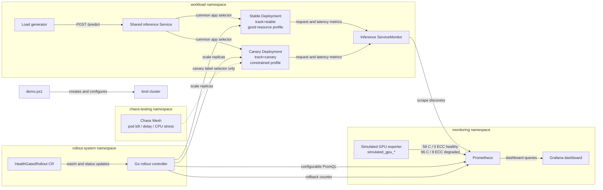
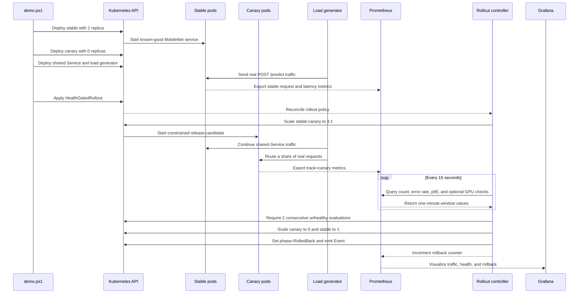
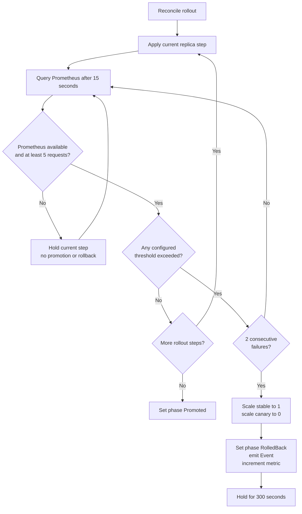

# Kubernetes Health Rollout Controller

This project demonstrates a safer way to release a new application version on
Kubernetes. Instead of replacing every running instance at once, it keeps the
known-good version running and sends only part of the traffic to the new version.

The known-good version is called **stable**. The new version being tested is
called the **canary**. Prometheus measures the canary's request errors, response
time, and simulated GPU health. A custom Go controller checks those measurements
before allowing the release to continue. If the canary remains healthy, the
controller moves to the next rollout step. If it repeatedly exceeds a safety
limit, the controller stops the canary and returns all traffic to stable.

The project also includes Chaos Mesh experiments for testing failures and a
Grafana dashboard for viewing traffic, latency, GPU signals, and rollbacks. The
complete system runs locally in a `kind` cluster and does not require production
access or GPU hardware.


## Quick Start

Prerequisites: Docker Desktop, `kind`, `kubectl`, Helm, and PowerShell 7. The
default demo does not require a GPU.

```powershell
.\scripts\demo.ps1
```

Include the pinned Chaos Mesh installation and server-side experiment
validation with:

```powershell
.\scripts\demo.ps1 -InstallChaos
```

The script creates or reuses `health-rollout`, deploys the complete stack,
switches the explicitly simulated GPU exporter to degraded mode, and exits only
after the controller reports `RolledBack`. See [the captured results](docs/results/README.md).

## 1. Motivation

Modern infra teams (especially AI/ML platform teams) need deployments that can detect unhealthy rollouts and roll back automatically before impact spreads. This project demonstrates that pattern end-to-end using a real inference workload, not a mocked-up service, so the health signals being gated on are genuine. Scope is deliberately staged: prove the core rollback loop first, then layer on GPU signals and chaos-induced failure as convincing enhancements.

## 2. Goals

- Build a custom Kubernetes controller that watches a rollout and gates progression on health signals from Prometheus.
- Serve a real small-model inference workload so app health signals reflect actual behavior under real load, not scripted toggles.
- Get a reliable stable/canary rollback loop working end-to-end before adding GPU or chaos features.
- Visualize the loop (deploy → detect → rollback) in Grafana and in a recorded terminal demo.
- Produce a portfolio-ready GitHub repo: one-command demo, clear README, recorded GIF/asciinema.

## 3. Non-Goals

- Not a production-hardened controller (no multi-tenancy, RBAC hardening, HA leader election beyond basics).
- Not a large-scale model — inference service uses MobileNet/ONNX, chosen for being lightweight and deterministic.
- Not integrating with a real cloud provider.
- Not claiming real GPU telemetry when running without GPU hardware — simulated GPU signals are named and documented as simulated, never as real DCGM metrics.

## 4. MVP Scope (Milestones 1–4) vs. Later Increments

**MVP — build and prove this first:**
1. Real inference service (MobileNet/ONNX) with genuine Prometheus metrics
2. Prometheus + Grafana stack (installed before validating load metrics)
3. Load generator producing real, visible traffic
4. Controller with a defined stable/canary rollout and an app-health-triggered rollback

**Later increments — add only once the MVP rollback loop is reliable:**
- GPU telemetry (simulated, clearly labeled)
- Chaos Mesh failure injection
- Dashboard polish / annotations

Rationale: a working rollback loop is the actual portfolio proof point. GPU and chaos features are convincing enhancements on top of that proof, not substitutes for it — and building them first risks a flashy-looking repo that doesn't reliably do the one thing it claims to do.

## 5. Architecture Overview

The system separates workload execution, rollout control, monitoring, and fault
injection into four namespaces. The controller changes replica counts; it never
handles application traffic. Prometheus is the boundary between workload health
and rollout decisions.



### 5.1 Traffic and ownership

- The stable and canary Deployments both use `app: inference-service`, so one
  Kubernetes Service sends traffic to both.
- Their distinct `track: stable` and `track: canary` labels are attached to
  application metrics. Prometheus can therefore evaluate the canary without
  mixing its measurements with the stable version.
- Traffic weighting is approximate and follows the replica ratio. The first
  rollout step uses three stable replicas and one canary replica, or roughly
  75% stable / 25% canary. The second step uses one of each, or roughly 50/50.
- The `HealthGatedRollout` custom resource is the desired policy. The Go
  controller owns the scaling decisions and writes phase, step, failure count,
  timestamps, and conditions back to its status.
- Prometheus scrapes the inference service, simulated GPU exporter, Kubernetes
  state metrics, and the controller's rollback counter. Grafana reads the same
  data used by the controller, making the decision path observable.

### 5.2 What “good” and “bad” mean in this demo

The application test does not hide a scripted failure inside a separate bad
binary. Both Deployments use `inference-service:v0.1.0`, but they represent two
release configurations:

| Release | Initial replicas | CPU request | CPU limit | Purpose |
|---|---:|---:|---:|---|
| Stable / good | 1 | 200m | 1 core | Known-good baseline with enough inference capacity |
| Canary / degraded | 0 | 100m | 200m | Release candidate deliberately constrained under real MobileNet traffic |

The canary starts at zero replicas. Applying the rollout custom resource makes
the controller deploy it at the first 3:1 step. The load generator continues to
send real PNG uploads to `/predict`; requests that land on the constrained
canary produce genuine latency or error measurements rather than fabricated
application responses.

The GPU-gated demonstration is a second, independent failure path. Its exporter
is clearly simulated and changes from a healthy profile (`58 C`, `0` ECC errors)
to a degraded profile (`96 C`, `8` ECC errors). The GPU rollout deliberately
sets permissive application thresholds so the recorded rollback can be
attributed specifically to the two GPU checks.

### 5.3 Deployment sequence



The deployment order matters. Prometheus and the load generator are running
before the rollout starts, giving the controller real traffic data as soon as
the canary becomes Ready. If Prometheus is unavailable, a query is empty, or
fewer than five canary requests exist in the one-minute window, the controller
holds the current step. It never promotes or rolls back from missing evidence.

### 5.4 How the metrics changed

The controller evaluates these signals from Prometheus:

| Signal | Healthy behavior | Degraded behavior | App rollout limit | GPU rollout limit |
|---|---|---|---:|---:|
| Canary request count | At least 5 requests in 1 minute | Same prerequisite | 5 minimum | 5 minimum |
| Canary HTTP 5xx rate | Near 0 | Rises if inference fails | 5% | 50% |
| Canary p95 latency | Stable remains much lower | Observed canary p95 reached 0.7651 s | 0.05 s | 10 s |
| Simulated GPU temperature | 58 C | 96 C | Not configured | 85 C |
| Simulated GPU ECC errors | 0 | 8 | Not configured | 1 |

The app-health rollout rolled back when real canary latency exceeded its limit:

```text
Health thresholds exceeded: latency 0.7651s > 0.0500s
```

The separately verified GPU rollout rolled back with both simulated signals in
the reason:

```text
Health thresholds exceeded: simulated GPU temperature 96.0000 > 85.0000,
simulated GPU ECC errors 8.0000 > 1.0000
```

### 5.5 Rollback decision



Two failures must be separated by the configured 15-second evaluation interval;
extra reconciliations cannot accelerate the count. On rollback, the controller
restores `inference-stable` to one replica, scales `inference-canary` to zero,
sets `status.phase` to `RolledBack`, emits a `RolloutRolledBack` Event, increments
`health_gated_rollout_rollbacks_total`, and starts a five-minute cooldown.

The verified dashboard below shows the replica transitions, real request rate,
p95 latency, and rollback count. The complete captured results and simulated GPU
view are in [docs/results/README.md](docs/results/README.md).


## 6. Components

### 6.1 `/controller` — Rollout Controller
- Language: Go, built with `kubebuilder` or `operator-sdk`.
- Watches a custom `HealthGatedRollout` CRD that manages **stable and canary Deployments sitting behind a single shared Service** (see 6.2 for the traffic-routing model) — this is what lets the controller shift traffic and roll back cleanly.
- Progresses canary in defined steps by adjusting the **stable:canary replica ratio** behind the shared Service (e.g., 9:1 → 1:1 → 0:1, approximating 10% → 50% → 100% traffic).
- **Rollout behavior is precisely specified, not left implicit:**
  - **Observation window:** e.g., evaluate metrics over a rolling 60s window per step.
  - **Minimum sample count:** don't evaluate a step's health until at least N requests have been observed in the window — avoids judging on too little data.
  - **Thresholds:** explicit numeric thresholds for error rate and p95/p99 latency, defined per step.
  - **Consecutive-failure requirement / cooldown:** require the threshold to be breached for M consecutive evaluation cycles before triggering rollback, and apply a cooldown after any rollback before the controller will re-attempt promotion — avoids noisy single-sample metrics triggering a flapping rollback.
  - **Prometheus unavailable / no-data behavior:** explicitly defined — e.g., treat a failed/empty Prometheus query as "hold at current step, do not promote, do not roll back" rather than either failing open (promote blindly) or failing closed (roll back on missing data). This distinction is a good interview talking point.
- On confirmed breach: pauses rollout, scales canary replicas back to zero (rollback, per the shared-Service model in 6.2), emits a Kubernetes Event and a Prometheus-visible marker.
- **Signal-provider interface:** the controller consumes health signals through a small internal interface (e.g., `SignalProvider.Evaluate(step) (healthy bool, reason string)`), backed by a single implementation that queries Prometheus using **configurable PromQL** (query strings supplied via CRD/config, not hardcoded). This is also how the later GPU increment plugs in (see 6.4): DCGM Exporter, like the simulated exporter, only ever exposes Prometheus metrics — it is not itself a `SignalProvider` implementation. Swapping simulated GPU signals for real DCGM later means changing the PromQL query configuration, not writing new controller logic.
- Reconcile loop and rollout-decision logic are the core pieces to showcase in interviews/READMEs.

### 6.2 `/inference-service` — Real Inference Workload
- **MobileNet via ONNX Runtime**, behind a small FastAPI (or Go) server. Chosen specifically over an LLM or Whisper workload because it's lighter, faster to iterate on, and far more deterministic — important when you're trying to reason precisely about thresholds and observation windows.

**Traffic-routing model (resolve first — this drives the CRD design, metrics labels, controller behavior, and demo architecture):** separate stable/canary Services cannot provide weighted traffic splitting (10/50/100) on their own — a Service just load-balances evenly across whatever pods match its selector. Two options:
  - **Shared Service, approximate weighting (MVP choice):** one Service selects both stable and canary pods via a common label (e.g., `app: inference-service`); the stable:canary **replica count ratio** approximates the traffic split (e.g., 9 stable + 1 canary ≈ 10% canary traffic). Simple, no extra infrastructure, good enough for a portfolio demo.
  - **Gateway API / service mesh, exact weighting:** precise percentage-based traffic splitting, but adds real infrastructure (Gateway API implementation or a mesh like Istio/Linkerd) — worth calling out as a stretch goal, not MVP scope.
  - **MVP uses the shared-Service approach.**
- Stable and canary run as **separate Deployments** (distinct pod template labels, e.g., `track: stable` / `track: canary`) but sit behind the one shared Service described above.
- **Metrics must be labeled to be evaluable per-track:** request-count and latency-histogram metrics expose a `track` label (`stable`|`canary`) — and ideally `pod` or `version` too — so the controller's PromQL queries can isolate canary health independently from stable (e.g., `rate(http_requests_total{track="canary", status="5xx"}[60s])`). Without this label, the controller has no way to tell which track a given metric sample came from.
- Exposes real Prometheus metrics: request count, error count, latency histogram — derived from actual inference calls, all carrying the `track` label above.
- CPU-only by default; runs identically with or without GPU hardware, since MobileNet inference on CPU is fast enough for demo purposes.
- Hardened over time (not required for MVP, but on the roadmap): pinned image versions, readiness/liveness probes, a defined security context, and the Prometheus instrumentation above.

**How the canary becomes unhealthy (important — load alone doesn't create failure):** a rollout is only risky if the new version actually behaves worse than the old one. Sending load at two identical healthy versions just produces two sets of healthy metrics. So the canary must be deliberately, controllably worse than stable. For the primary demo, use:
  - **Resource-starved canary (MVP mechanism):** canary Deployment sets a CPU/memory limit deliberately too low for MobileNet inference under load, so it starts throwing errors or slowing down once real traffic ramps up. This is a genuine health signal — the canary really is failing under real resource pressure, not pretending to.
  - Avoid an injected-fault flag (e.g., `INJECT_FAULT=true`) as the *primary* demo mechanism — it works, but it sits awkwardly against the project's core goal of genuine health signals over scripted toggles. It's fine as a documented alternative/fallback for fast iteration while developing thresholds, just not the headline mechanism in the README/demo.
  - **Broken dependency/config** (e.g., wrong model file path) remains a documented "more realistic, less deterministic" alternative, not MVP default.
- The load-generator (6.3) is what turns this engineered flaw into real, measurable degraded metrics (rising error rate, rising p95 latency) for the controller to detect — load and "the canary is resource-starved" are two separate, necessary ingredients, not one mechanism.

### 6.3 `/load-generator` — Real Traffic Driver
- A dependency-free Python process creates a real PNG in memory and uploads it
  to `POST /predict` as multipart form data. No sample image or volume mount is
  required.
- `TARGET_URL`, `REQUESTS_PER_SECOND`, and `REQUEST_TIMEOUT_SECONDS` make the
  destination, traffic rate, and timeout configurable from the Deployment.
- The initial Deployment sends one request per second. Raising
  `REQUESTS_PER_SECOND` later will test the controller's response to genuine
  degradation under load.

Build, load, and deploy it locally:

```powershell
docker build -t load-generator:v0.1.0 .\load-generator
kind load docker-image load-generator:v0.1.0 --name health-rollout
kubectl apply -f .\kubernetes\workload\load-generator-deployment.yaml
kubectl rollout status deployment/load-generator -n workload
kubectl logs deployment/load-generator -n workload --tail=10
```

Useful Grafana/Prometheus queries:

```promql
# Requests per second
sum(rate(inference_http_requests_total{track="stable",path="/predict"}[1m]))

# Fraction of requests returning HTTP 5xx; show zero before any 5xx exists
(sum(rate(inference_http_requests_total{track="stable",path="/predict",status=~"5.."}[5m])) or vector(0))
/ clamp_min(sum(rate(inference_http_requests_total{track="stable",path="/predict"}[5m])), 0.001)

# 95th-percentile inference latency in seconds
histogram_quantile(0.95,
  sum by (le) (
    rate(inference_http_request_duration_seconds_bucket{track="stable",path="/predict"}[5m])
  )
)
```

### 6.3.1 Run the Health-Gated Rollout

Build and load the controller image, install its CRD and controller, then create
the sample rollout:

```powershell
docker build -t health-rollout-controller:v0.1.0 .\controller
kind load docker-image health-rollout-controller:v0.1.0 --name health-rollout
kubectl apply -k .\controller\config\default
kubectl rollout status deployment/rollout-controller-manager -n rollout-system
kubectl apply -f .\controller\config\samples\rollout_v1alpha1_healthgatedrollout.yaml
```

Watch the decision and verify replica restoration after rollback:

```powershell
kubectl get healthgatedrollout inference-rollout -n workload -w
kubectl get deployments inference-stable inference-canary -n workload
kubectl get events -n workload --field-selector involvedObject.name=inference-rollout
```

The sample holds when Prometheus has no data, waits for at least five canary
requests, and requires two unhealthy evaluations 15 seconds apart. On rollback,
stable returns to one replica and canary returns to zero for a five-minute
cooldown.

### 6.4 `/gpu-metrics` — Simulated GPU Telemetry (later increment, not MVP)
- Named and exposed explicitly as **`simulated_gpu_*`** metrics (e.g., `simulated_gpu_ecc_errors_total`, `simulated_gpu_util_percent`) — never published under real `DCGM_FI_DEV_*` names, since doing so on a CPU-only signal would be misleading to anyone reading the metrics or the code.
- Both the simulated exporter and a real DCGM Exporter are Prometheus metric sources; neither is itself a `SignalProvider`. The controller's Prometheus-backed provider evaluates configurable additional checks. Swapping simulated GPU signals for real DCGM later means changing query configuration, not controller logic.
- Real GPU access through `kind` (especially on Windows/WSL2) is expected to be one of the hardest parts of this project environment-wise. The CPU/simulated path is the **guaranteed, documented local demo**; real-GPU mode is documented as an explicitly optional, separate environment path — not something the main demo depends on.

### 6.5 `/chaos` — Failure Injection (later increment, sequenced after MVP rollback works)
- **Sequencing matters:** first prove rollback works using ordinary load/resource pressure from the load-generator alone (6.3). Only after that's reliable, layer in Chaos Mesh. Introducing chaos tooling before the basic loop is proven mixes two sources of failure (chaos tool misconfiguration vs. controller logic bugs) and makes debugging much harder.
- Chaos Mesh experiment manifests (pod kill, network latency, CPU stress) to produce failure conditions beyond what the load-generator alone can create.
- Deployed in its own `chaos-testing` namespace, separate from the workload and monitoring stacks.

### 6.6 `/dashboards` — Grafana Dashboards (polish increment, after MVP)
- A dashboard ConfigMap is checked into git and loaded by Grafana's sidecar.
- Panels show stable/canary replicas, request rate, error rate, p95 latency,
  rollback count, and explicitly labeled simulated GPU telemetry.
- Deployed via `kube-prometheus-stack` Helm chart, in its own `monitoring` namespace.

### 6.7 `/scripts` — One-Command Demo
- `demo.ps1`:
  1. Spin up `kind` cluster
  2. Create namespaces: `workload`, `monitoring`, `rollout-system`
  3. Install `kube-prometheus-stack` into `monitoring`
  4. Deploy stable + canary `inference-service` (behind the shared Service, per 6.2), controller + CRDs into their namespaces
  5. Start the load-generator against the shared Service
  6. Switch the simulated GPU exporter to its degraded profile and start a rollout
  7. Show the controller detecting both GPU threshold breaches and rolling back
  8. Print a link/hint to open the Grafana dashboard
- `-InstallChaos` installs pinned Chaos Mesh 2.8.0 and validates all experiment manifests against its admission webhooks.

**Environment requirements:**
- Windows PowerShell 7
- Docker Desktop (with WSL2 integration enabled, if on Windows)
- `kind`, `kubectl`, `helm` — versions pinned in README
- No GPU drivers/toolkit required for the default CPU/simulated path

## 7. Milestones

| # | Milestone | Deliverable | Status |
|---|-----------|-------------|--------|
| 1 | Local cluster + real inference service | kind cluster, namespaces, stable inference, and real requests | Complete |
| 2 | Prometheus + Grafana | Monitoring stack scraping the inference service | Complete |
| 3 | Load generator | Configurable real traffic with latency/error metrics | Complete |
| 4 | Controller v1 | Timed evaluation, no-data hold, promotion, and app-health rollback | Complete |
| 5 | Simulated GPU metrics | Explicit `simulated_gpu_*` exporter and configurable PromQL checks | Complete |
| 6 | Chaos experiments | Scoped pod-kill, network-delay, and CPU-stress experiments | Complete |
| 7 | Dashboards + annotations | Provisioned rollout, app, rollback, and simulated GPU panels | Complete |
| 8 | Demo polish | Idempotent PowerShell demo, screenshots, results, and README | Complete |

**Best first portfolio checkpoint:** milestones 1–4 complete — a real inference service with metrics, a stable/canary rollout, and an app-health-triggered rollback that works reliably. That alone is a legitimate, demo-able project. GPU and chaos features are enhancements on top of it, not blockers to shipping it.

## 8. Portfolio Evidence

- [Runtime results and screenshots](docs/results/README.md)
- [One-command demo](scripts/demo.ps1)
- [Grafana dashboard manifest](dashboards/health-rollout-dashboard.yaml)
- [Chaos Mesh experiments](chaos/)

## 9. Stretch Goals (optional, well beyond MVP)

- Support multiple rollback strategies (immediate vs. gradual) and benchmark recovery time.
- Add a PromQL-based Alertmanager rule feeding directly into the controller's decision loop.
- Multi-cluster simulation (two `kind` clusters) to show cross-cluster rollout safety.
- Validate the controller's PromQL queries against real DCGM Exporter metric names if real GPU hardware access becomes available (see project notes — parked for now).

## 10. Tech Stack Summary

- **Cluster:** kind (Kubernetes-in-Docker), namespaced: `workload`, `monitoring`, `rollout-system`, `chaos-testing`
- **Controller:** Go, kubebuilder/operator-sdk, client-go
- **Inference workload:** FastAPI/Go server + MobileNet (ONNX Runtime), CPU-only by default
- **Load generation:** k6, hey, or a small custom script
- **Metrics:** Prometheus, kube-prometheus-stack (Helm), Grafana
- **Simulated GPU telemetry:** `simulated_gpu_*`-named Prometheus exporter with configurable controller checks, swappable for real DCGM metrics later
- **Chaos:** Chaos Mesh (introduced after MVP rollback is proven)
- **Demo automation:** PowerShell one-command workflow with checked-in runtime evidence