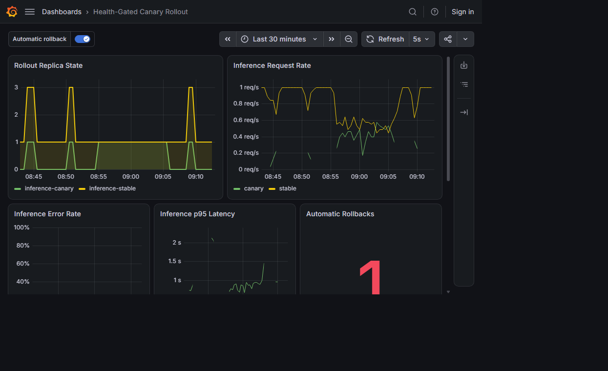
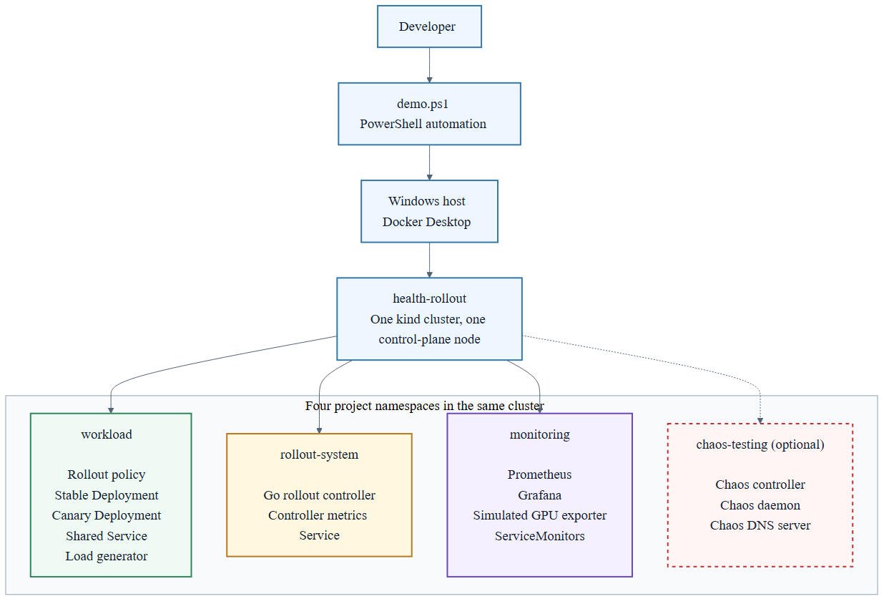
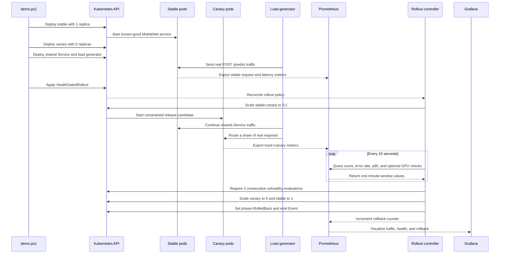
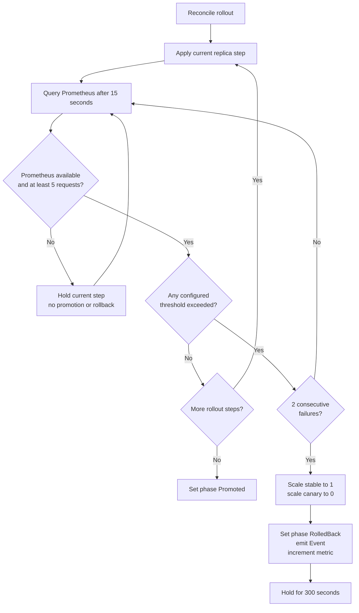

# Kubernetes Health Rollout Controller

This project demonstrates a safer way to release a new application version on
Kubernetes. Instead of replacing every running instance at once, it keeps the
known-good version running and sends only part of the traffic to the new version.

The known-good version is called **stable**. The new version being tested is
called the **canary**. Prometheus measures the canary's request errors, response
time, and simulated GPU health. A custom Go controller checks those measurements
before allowing the release to continue. If the canary remains healthy, the
controller moves to the next rollout step. If it repeatedly exceeds a safety
limit, the controller stops the canary and returns all traffic to stable.

The project also includes Chaos Mesh experiments for testing failures and a
Grafana dashboard for viewing traffic, latency, GPU signals, and rollbacks. The
complete system runs locally in a `kind` cluster and does not require production
access or GPU hardware.



## Quick Start

Prerequisites: Docker Desktop, `kind`, `kubectl`, Helm, and PowerShell 7. The
default demo does not require a GPU.

`demo.ps1` is an automation script, not a Kubernetes component. Running it is
equivalent to executing all setup and demonstration commands manually. It:

1. Creates or reuses the local `health-rollout` kind cluster.
2. Installs Prometheus and Grafana with Helm.
3. Builds the inference service, load generator, GPU exporter, and Go controller
  container images, then loads them into kind.
4. Applies the Kubernetes resources and waits for every Deployment to become
  ready.
5. Changes the simulated GPU exporter from healthy to degraded, starts a
  `HealthGatedRollout`, and waits until the controller proves the rollback.
6. Prints the rollback reason, final stable/canary replica counts, and the
  command for opening Grafana.

The script stops immediately if a required command fails. It can be rerun
because it reuses the named cluster and updates existing resources.

```powershell
.\scripts\demo.ps1
```

Include the pinned Chaos Mesh installation and server-side experiment
validation with:

```powershell
.\scripts\demo.ps1 -InstallChaos
```

The script creates or reuses `health-rollout`, deploys the complete stack,
switches the explicitly simulated GPU exporter to degraded mode, and exits only
after the controller reports `RolledBack`. See [the captured results](docs/results/README.md).

## 1. Goals

- Release a new inference-service configuration gradually while the known-good
  configuration continues serving traffic.
- Use real request volume, HTTP errors, and latency from a MobileNet/ONNX
  workload to decide whether a release can continue.
- Support additional Prometheus health checks, demonstrated with explicitly
  simulated GPU temperature and ECC error metrics.
- Roll back automatically only after repeated threshold failures, while holding
  safely when Prometheus is unavailable or there is not enough traffic.
- Make the complete deploy, observe, and rollback path reproducible on a local
  machine with one command.
- Show rollout state, application health, GPU signals, and rollback events in
  Grafana, with Chaos Mesh experiments for controlled failure testing.

## 2. Deployment Architecture

The project runs in **one Kubernetes cluster**, named `health-rollout`. It is a
local `kind` cluster with **one control-plane node**. Docker Desktop hosts the
kind node container, and containerd inside that node runs the Kubernetes pods.
There are no cloud clusters or external runtime services.



The image source is checked in as
[`docs/deployment-architecture.mmd`](docs/deployment-architecture.mmd), so the
diagram can be updated and rendered again when the deployment changes.

| Scope | Count | Purpose |
|---|---:|---|
| Kubernetes clusters | 1 | Local cluster named `health-rollout` |
| Kubernetes nodes | 1 | kind control-plane node running the full stack |
| Project namespaces | 4 | `workload`, `rollout-system`, `monitoring`, `chaos-testing` |
| Rollout controllers | 1 | Watches `HealthGatedRollout` resources and scales Deployments |
| Inference tracks | 2 | Stable baseline and canary release candidate |
| Shared inference Services | 1 | Distributes requests across ready stable and canary pods |

The rollout policy object lives beside the Deployments in `workload`, but the
controller that acts on it runs in `rollout-system`. This separation keeps the
application resources independent from the control process. Monitoring has its
own namespace because both the controller and Grafana depend on Prometheus, and
Chaos Mesh is isolated so failure experiments can be installed or removed
without changing the application or controller manifests.

The diagram shows the full deployment created with `demo.ps1 -InstallChaos`.
The default command uses the same single cluster but omits the `chaos-testing`
namespace and its three Chaos Mesh components.

## 3. Runtime Architecture

The system separates workload execution, rollout control, monitoring, and fault
injection into four namespaces. The controller changes replica counts; it never
handles application traffic. Prometheus is the boundary between workload health
and rollout decisions.


### 3.1 Traffic and ownership

- The stable and canary Deployments both use `app: inference-service`, so one
  Kubernetes Service sends traffic to both.
- Their distinct `track: stable` and `track: canary` labels are attached to
  application metrics. Prometheus can therefore evaluate the canary without
  mixing its measurements with the stable version.
- Traffic weighting is approximate and follows the replica ratio. The first
  rollout step uses three stable replicas and one canary replica, or roughly
  75% stable / 25% canary. The second step uses one of each, or roughly 50/50.
- The `HealthGatedRollout` custom resource is the desired policy. The Go
  controller owns the scaling decisions and writes phase, step, failure count,
  timestamps, and conditions back to its status.
- Prometheus scrapes the inference service, simulated GPU exporter, Kubernetes
  state metrics, and the controller's rollback counter. Grafana reads the same
  data used by the controller, making the decision path observable.

### 3.2 What “good” and “bad” mean in this demo

The application test does not hide a scripted failure inside a separate bad
binary. Both Deployments use `inference-service:v0.1.0`, but they represent two
release configurations:

| Release | Initial replicas | CPU request | CPU limit | Purpose |
|---|---:|---:|---:|---|
| Stable / good | 1 | 200m | 1 core | Known-good baseline with enough inference capacity |
| Canary / degraded | 0 | 100m | 200m | Release candidate deliberately constrained under real MobileNet traffic |

The canary starts at zero replicas. Applying the rollout custom resource makes
the controller deploy it at the first 3:1 step. The load generator continues to
send real PNG uploads to `/predict`; requests that land on the constrained
canary produce genuine latency or error measurements rather than fabricated
application responses.

The GPU-gated demonstration is a second, independent failure path. Its exporter
is clearly simulated and changes from a healthy profile (`58 C`, `0` ECC errors)
to a degraded profile (`96 C`, `8` ECC errors). The GPU rollout deliberately
sets permissive application thresholds so the recorded rollback can be
attributed specifically to the two GPU checks.

### 3.3 Deployment sequence



The deployment order matters. Prometheus and the load generator are running
before the rollout starts, giving the controller real traffic data as soon as
the canary becomes Ready. If Prometheus is unavailable, a query is empty, or
fewer than five canary requests exist in the one-minute window, the controller
holds the current step. It never promotes or rolls back from missing evidence.

### 3.4 How the metrics changed

The controller evaluates these signals from Prometheus:

| Signal | Healthy behavior | Degraded behavior | App rollout limit | GPU rollout limit |
|---|---|---|---:|---:|
| Canary request count | At least 5 requests in 1 minute | Same prerequisite | 5 minimum | 5 minimum |
| Canary HTTP 5xx rate | Near 0 | Rises if inference fails | 5% | 50% |
| Canary p95 latency | Stable remains much lower | Observed canary p95 reached 0.7651 s | 0.05 s | 10 s |
| Simulated GPU temperature | 58 C | 96 C | Not configured | 85 C |
| Simulated GPU ECC errors | 0 | 8 | Not configured | 1 |

The app-health rollout rolled back when real canary latency exceeded its limit:

```text
Health thresholds exceeded: latency 0.7651s > 0.0500s
```

The separately verified GPU rollout rolled back with both simulated signals in
the reason:

```text
Health thresholds exceeded: simulated GPU temperature 96.0000 > 85.0000,
simulated GPU ECC errors 8.0000 > 1.0000
```

### 3.5 Rollback decision



Two failures must be separated by the configured 15-second evaluation interval;
extra reconciliations cannot accelerate the count. On rollback, the controller
restores `inference-stable` to one replica, scales `inference-canary` to zero,
sets `status.phase` to `RolledBack`, emits a `RolloutRolledBack` Event, increments
`health_gated_rollout_rollbacks_total`, and starts a five-minute cooldown.

The verified dashboard below shows the replica transitions, real request rate,
p95 latency, and rollback count. The complete captured results and simulated GPU
view are in [docs/results/README.md](docs/results/README.md).


## 4. Components

### 4.1 Rollout controller

The Go controller in [`controller/`](controller/) was built with Kubebuilder. It
watches `HealthGatedRollout` resources, scales the stable and canary Deployments,
queries Prometheus, records status conditions, emits Kubernetes Events, and
exports `health_gated_rollout_rollbacks_total`.

Its sample policy uses two replica steps: 3 stable / 1 canary, followed by
1 stable / 1 canary. It evaluates one-minute Prometheus windows every 15 seconds,
requires at least five canary requests, and rolls back after two consecutive
unhealthy evaluations. Missing data causes a hold rather than a promotion or
rollback.

### 4.2 Inference service and traffic

[`inference-service/`](inference-service/) is a FastAPI application running
MobileNet through ONNX Runtime. Stable and canary are separate Deployments with
`track` labels, but one shared Service selects both. Their replica ratio provides
approximate traffic weighting without a service mesh.

The stable Deployment requests 200m CPU and can use up to one core. The canary
requests 100m and is limited to 200m, making it slower under real inference load.
Both expose request counters and latency histograms labeled by track, and both
include startup, readiness, and liveness probes plus restricted security
contexts.

### 4.3 Load generator

[`load-generator/`](load-generator/) contains a dependency-free Python process
that creates a PNG in memory and continuously uploads it to `POST /predict`.
`TARGET_URL`, `REQUESTS_PER_SECOND`, and `REQUEST_TIMEOUT_SECONDS` configure the
traffic without rebuilding the image.

### 4.4 Simulated GPU telemetry

[`gpu-metrics/`](gpu-metrics/) exposes clearly named `simulated_gpu_*` metrics.
Healthy mode reports 58 C and zero ECC errors; degraded mode reports 96 C and
eight ECC errors. These are test signals, not hardware measurements or DCGM
metrics. The controller evaluates them through the same configurable PromQL
check mechanism used for application signals.

### 4.5 Monitoring and dashboard

The Helm-installed kube-prometheus-stack runs in `monitoring`. ServiceMonitors
discover the inference service, GPU exporter, and controller. The checked-in
Grafana dashboard shows replica state, request rate, error rate, p95 latency,
rollback count, and simulated GPU health.

### 4.6 Failure injection

[`chaos/`](chaos/) contains scoped Chaos Mesh experiments for canary pod
termination, 250 ms outbound network delay, and one CPU stress worker at 80%
load. Every selector requires both `app: inference-service` and `track: canary`,
so the stable Deployment is not targeted.

### 4.7 Demo automation

[`scripts/demo.ps1`](scripts/demo.ps1) creates or reuses the cluster, installs
monitoring, builds and loads the local images, deploys the complete system,
switches the simulated GPU exporter to degraded mode, and waits for a confirmed
rollback. `-InstallChaos` also installs pinned Chaos Mesh 2.8.0 and validates the
experiment manifests.

## 5. Evidence

- [Runtime results and screenshots](docs/results/README.md)
- [One-command demo](scripts/demo.ps1)
- [Grafana dashboard manifest](dashboards/health-rollout-dashboard.yaml)
- [Chaos Mesh experiments](chaos/)

## 6. Tech Stack

- **Cluster:** one single-node kind cluster
- **Controller:** Go, Kubebuilder, controller-runtime, client-go
- **Inference workload:** Python, FastAPI, MobileNet, ONNX Runtime
- **Load generation:** custom dependency-free Python process
- **Metrics:** Prometheus, kube-prometheus-stack (Helm), Grafana
- **GPU test signals:** dependency-free Python Prometheus exporter
- **Failure injection:** Chaos Mesh 2.8.0
- **Automation:** PowerShell, Docker, kind, kubectl, Helm