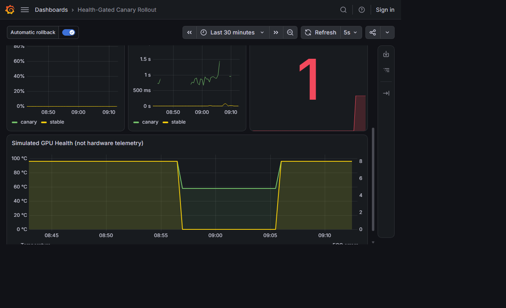

# Verified Results

Validated on 2026-09-12 with a local kind cluster named `health-rollout`.

## GPU-gated rollback

Prometheus scraped the simulated GPU exporter successfully in healthy mode:

| Signal | Healthy | Degraded | Maximum |
|---|---:|---:|---:|
| `simulated_gpu_temperature_celsius` | 58 | 96 | 85 |
| `simulated_gpu_ecc_errors_total` | 0 | 8 | 1 |

The degraded run reached `status.phase: RolledBack` with this controller reason:

```text
Health thresholds exceeded: simulated GPU temperature 96.0000 > 85.0000,
simulated GPU ECC errors 8.0000 > 1.0000
```

After rollback, `inference-stable` had one ready replica and
`inference-canary` had zero desired replicas. Prometheus reported
`health_gated_rollout_rollbacks_total=1` for `gpu-health-rollout`.

## Chaos experiments

Chaos Mesh 2.8.0 was installed in `chaos-testing`. Each experiment was applied
separately and removed before the next one:

| Experiment | Observed result |
|---|---|
| Pod kill | Selected `inference-canary-5cc7fcbdbb-4gsw4`; Deployment replaced it with `inference-canary-5cc7fcbdbb-52dnd` |
| Network delay | `Injected`, one selected canary pod, 250 ms outbound delay |
| CPU stress | `Injected`, one selected canary container, one worker at 80% load |

The canary Deployment returned to Available after all experiments.

## Grafana


